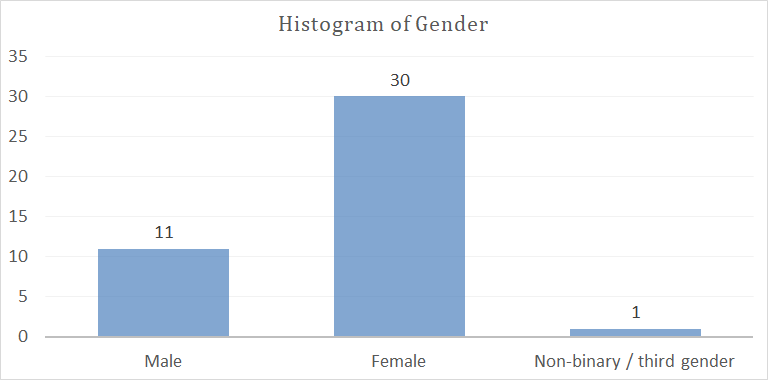
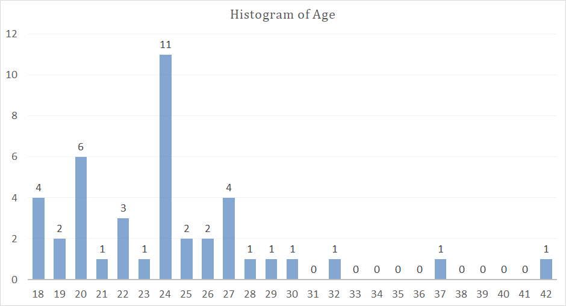
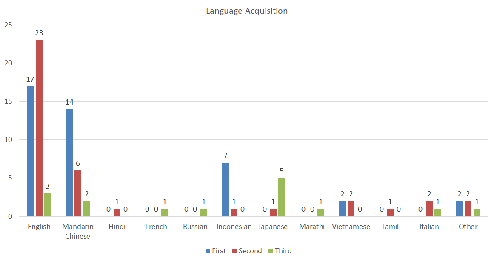
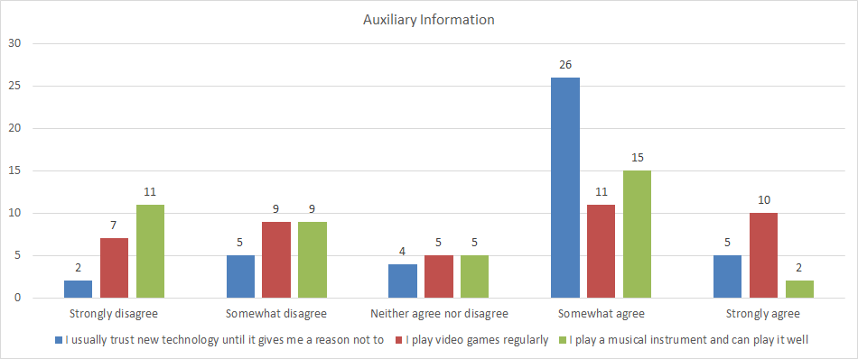

# 
TED-Culture: Culturally Inclusive Co-Speech Gesture Generation for Embodied Social Agents

Yixin Shen*, Wafa Johal

# 🌀 Abstract

Generating natural and expressive co-speech gestures for conversational virtual agents and social robots remains a persistent challenge, crucial for enhancing their acceptability and usage in real-world contexts. The strong cultural and linguistic influences on co-speech gestures further complicate this issue, highlighting the problem of the limited availability of cross-cultural co-speech gesture datasets. This study introduces a novel dataset, the **TED-Culture** Dataset, derived from TED talks, focusing on cross-cultural gesture generation based on linguistic cues. The proposed generative model based on the Stable Diffusion Model surpasses state-of-the-art baselines on the TED-Expressive Dataset and demonstrates rapid convergence across several specific languages within the TED-Culture Dataset, specifically Indonesian, Japanese, and Italian. The approach has been implemented on the NAO robot, showing its ability to produce contextually appropriate gestures in real-time. Results indicate improvements in the naturalness and communicative effectiveness of the generated gestures, validated through both objective and subjective evaluations. Also, it shows that individuals are more critical of co-speech gestures in their native language and expect higher performance from generative models in this context. By releasing the dataset, we allow for further research on multilingual co-speech gesture generation for embodied conversational agents.

# 🌀 Objective Evaluation

**The Quantitative Results on TED-Culture for each specific language and merged, as well as TED-Expressive.** The results are the **average** of five experimental tests. We compare the proposed diffusion-based method against recent state-of-the-art (SOTA) methods and ground truth. Lower values are better for FGD, while higher values are better for the other metrics.

## Results for TED-Culture

### A. Indonesian

| Methods                   | FGD ↓     | BC ↑      | Diversity ↑ |
| ------------------------- | --------- | --------- | ----------- |
| Ground Truth              | 0         | 0.700     | 118.371     |
| Attention Seq2Seq         | 20.277    | 0.127     | 72.391      |
| Speech2Gesture            | 11.280    | 0.543     | 69.523      |
| Joint Embedding           | 20.340    | 0.122     | 70.457      |
| Trimodal                  | 5.650     | 0.431     | 94.302      |
| HA2G                      | 5.661     | 0.370     | 90.954      |
| DiffGesture (500 epochs)  | 10.777    | 0.748     | 79.173      |
| DiffGesture (1000 epochs) | 8.673     | 0.745     | 98.955      |
| DiffGesture (1500 epochs) | 5.529     | 0.740     | **100.937** |
| DiffCulture (Ours)        | **4.479** | **0.752** | 81.296      |

### B. Japanese

| Methods                   | FGD ↓     | BC ↑      | Diversity ↑ |
| ------------------------- | --------- | --------- | ----------- |
| Ground Truth              | 0         | 0.698     | 109.940     |
| Attention Seq2Seq         | 22.761    | 0.124     | 73.299      |
| Speech2Gesture            | 15.978    | 0.594     | 61.661      |
| Joint Embedding           | 21.013    | 0.115     | 57.239      |
| Trimodal                  | 6.002     | 0.462     | 75.393      |
| HA2G                      | **5.240** | 0.377     | 75.450      |
| DiffGesture (500 epochs)  | 24.156    | 0.754     | 80.964      |
| DiffGesture (1000 epochs) | 7.038     | 0.751     | **101.816** |
| DiffGesture (1500 epochs) | 6.937     | 0.741     | 55.514      |
| DiffCulture (Ours)        | 6.789     | **0.757** | 73.001      |

### C. German

| Methods            | FGD ↓     | BC ↑      | Diversity ↑ |
| ------------------ | --------- | --------- | ----------- |
| Ground Truth       | 0         | 0.697     | 110.940     |
| Attention Seq2Seq  | 24.296    | 0.143     | 94.698      |
| Speech2Gesture     | 28.989    | 0.553     | 91.730      |
| Joint Embedding    | 32.636    | 0.133     | 78.726      |
| Trimodal           | 7.094     | 0.427     | 97.749      |
| HA2G               | **4.592** | 0.346     | 103.393     |
| DiffGesture        | 6.518     | **0.737** | 105.490     |
| DiffCulture (Ours) | 6.340     | 0.736     | **108.693** |

### D. Italian

| Methods                   | FGD ↓     | BC ↑      | Diversity ↑ |
| ------------------------- | --------- | --------- | ----------- |
| Ground Truth              | 0         | 0.708     | 107.778     |
| Attention Seq2Seq         | 24.869    | 0.128     | 79.943      |
| Speech2Gesture            | 13.540    | 0.500     | 82.430      |
| Joint Embedding           | 21.924    | 0.128     | 80.033      |
| Trimodal                  | 5.312     | 0.401     | 81.957      |
| HA2G                      | 4.167     | 0.305     | 97.078      |
| DiffGesture (500 epochs)  | 11.199    | **0.746** | 96.475      |
| DiffGesture (1000 epochs) | 4.240     | 0.737     | 90.944      |
| DiffGesture (1500 epochs) | 3.523     | 0.736     | **102.729** |
| DiffCulture (Ours)        | **3.498** | 0.740     | 100.677     |

### E. French

| Methods            | FGD ↓     | BC ↑      | Diversity ↑ |
| ------------------ | --------- | --------- | ----------- |
| Ground Truth       | 0         | 0.697     | 99.684      |
| Attention Seq2Seq  | 23.411    | 0.136     | 87.000      |
| Speech2Gesture     | 14.113    | 0.589     | 84.301      |
| Joint Embedding    | 21.714    | 0.135     | 72.848      |
| Trimodal           | 5.002     | 0.438     | **98.100**  |
| HA2G               | **4.174** | 0.390     | 94.616      |
| DiffGesture        | 5.633     | **0.749** | 91.953      |
| DiffCulture (Ours) | 5.053     | 0.747     | 91.817      |

### F. Turkish

| Methods            | FGD ↓     | BC ↑      | Diversity ↑ |
| ------------------ | --------- | --------- | ----------- |
| Ground Truth       | 0         | 0.708     | 126.948     |
| Attention Seq2Seq  | 22.623    | 0.172     | 81.917      |
| Speech2Gesture     | 14.038    | 0.588     | 79.878      |
| Joint Embedding    | 28.655    | 0.128     | 78.210      |
| Trimodal           | 6.180     | 0.481     | 88.979      |
| HA2G               | 5.613     | 0.370     | 101.932     |
| DiffGesture        | 5.431     | 0.747     | **112.089** |
| DiffCulture (Ours) | **5.415** | **0.749** | 100.353     |

### G. Merged

| Methods            | FGD ↓     | BC ↑      | Diversity ↑ |
|--------------------|-----------|-----------|-------------|
| Ground Truth       | 0         | 0.702     | 181.900     |
| Attention Seq2Seq  | 27.858    | 0.205     | 150.985     |
| Speech2Gesture     | 53.676    | 0.567     | 136.512     |
| Joint Embedding    | 52.993    | 0.135     | 120.380     |
| Trimodal           | 12.026    | 0.396     | 146.988     |
| HA2G               | 5.919     | 0.310     | 160.225     |
| DiffGesture        | **4.216** | **0.728** | **175.025** |
| DiffCulture (Ours) | 5.532     | 0.722     | 160.603     |

## Results for TED-Expressive

| Methods                                       | FGD ↓ | BC ↑ | Diversity ↑ |
|-----------------------------------------------|------------------|---------------|----------------------|
| Ground Truth                                  | 0                | 0.703         | 178.827              |
| Attention Seq2Seq        | 54.920           | 0.152         | 122.693              |
| Speech2Gesture      | 54.650           | 0.679         | 142.489              |
| Joint Embedding  | 64.555           | 0.130         | 120.627              |
| Trimodal                 | 12.613           | 0.563         | 154.088              |
| HA2G                    | 5.306            | 0.641         | 173.899              |
| DiffGesture               | 2.600            | **0.718**     | **182.757**          |
| DiffCulture (Ours)                            | **2.398**        | 0.715         | 177.814              |

# 🌀 Subjective Evaluation
## Demographic

  
   
  <i>Histogram of Gender</i>

  
   
  <i>Histogram of Age</i>

  
   
  <i>Language Acquisition Stats</i>

  
   
  <i>Auxiliary Information about New Technology, Video Games and Music</i>

## Model Performance
**User Study Results.** The ratings for motion naturalness, smoothness, and synchrony are assessed on a scale of 1 to 5, where 5 indicates the highest performance. All the results in the table are presented in the format of Average (SD).

| Methods                                       | Naturalness ↓ | Smoothness ↑ | Synchrony ↑ |
|-----------------------------------------------|------------------|---------------|----------------------|
| Ground Truth        | 2.21 (0.94)      | 1.96 (0.74)  | 2.21 (0.86)     |
| Attention Seq2Seq   | **3.15** (0.69)      | **3.57** (0.52)  | **3.05** (0.64)     |
| Speech2Gesture      | 2.91 (0.73)    | 2.56 (0.65)   | 3.03 (0.80)     |
| Joint Embedding     | 2.66 (0.65)      | 3.37 (0.44)    | 2.41 (0.64)          |
| Trimodal            | 2.74 (1.01)      | 2.27 (0.82)   | 2.74 (1.04)          |
| HA2G                | 1.98 (0.69)      | 1.86 (0.64)   | 1.91 (0.64)         |
| DiffGesture         | 2.29 (0.81)      | 2.11 (0.59)   | 2.43 (0.63)          |
| DiffCulture (Ours)  | 2.59 (0.83)      | 2.27 (0.70)   | 2.52 (0.80)          |

**The correlation between language acquisition and the cultural back-ground of the participants.** The ratings for motion naturalness, smoothness, and synchrony are assessed on a scale of 1 to 5, where 5 indicates the highest performance. All the participants’ first or secondary proficient language is Indonesian. All the results in the table are presented in the format of Average (SD).

| Video Type                                  | Naturalness ↓ | Smoothness ↑ | Synchrony ↑ |
|-----------------------------------------------|------------------|---------------|----------------------|
| Indonesian Videos        | 1.94 (1.07)       | **2.18** (1.16)  | 1.80 (1.16)        |
| Non-Indonesian Videos    | **2.34 (1.05)**   | **2.18** (1.14)  | **2.34** (1.01)         |

# 🌀 Ablation Experiments

## A.Model Structure Experiments
**The Quantitative Results on TED-Culture Merged, focusing on model structure.** The results are the **average** of five experimental tests. We compared with different model architectures and conducted ablation studies to identify the relatively optimal model structure for this dataset. Lower values are better for FGD, while higher values are better for the other metrics.

| Methods                                                                    | FGD ↓ | BC ↑  | Diversity ↑ |
|----------------------------------------------------------------------------|------------------|----------------|----------------------|
| DiffGesture (The original one)                                             | **4.216**     | 0.728          | **175.025**     |
| DiffGesture (Add the text modality)                                        | 5.185            | 0.729          | 170.311              |
| DiffGesture (Audio encoder same as the one in `LivelySpeaker: Towards Semantic-Aware Co-Speech Gesture Generation`) | 6.354            | 0.729          | 168.824              |
| DiffGesture (New Audio Encoder but MSE loss)                               | 4.419            | **0.730** | 173.815              |
| DiffGesture (MSE loss $\to$ Huber loss, threshold = 1)                     | 4.415            | 0.728          | 174.177              |
| DiffGesture (MSE loss $\to$ Huber loss, threshold = 0.1)                   | 5.795            | 0.724          | 164.617              |
| DiffCulture (Ours, New Audio Encoder and Huber loss, threshold = 0.1)      | 5.532            | 0.722          | 160.603              |

## B.Proposed Modules Experiments
**Ablation Study on the Proposed Modules Based on TED-Culture Merged.** The results are the **average** of five experimental tests. We investigate the effectiveness of the proposed modules: the Diffusion Gesture Stabilizer and implicit classifier-free guidance. Lower values are better for FGD, while higher values are better for the other metrics.

| Methods                         | FGD ↓ | BC ↑  | Diversity ↑ |
|---------------------------------|------------------|----------------|----------------------|
| DiffCulture Base                | **5.116**     | **0.727** | 164.837              |
| DiffCulture w/o Stabilizer      | 6.233            | 0.726          | 162.175              |
| DiffCulture w/o classifier-free | 5.367            | 0.726          | **166.002**     |
| DiffCulture (Ours)              | 5.532            | 0.722          | 160.603              |

## C.Text Embedding Experiments
**Ablation study on the impact of using corresponding text embeddings in the DiffCulture model after incorporating the text modality on TED-Culture French.** The results represent the **average** of five experimental tests. We investigate the impact that whether or not using the corresponding language of FastText Word Embedding can have on model (with text modality) performance. For FGD, lower values indicate better performance, while higher values are preferable for the other metrics.

| Methods                                                                          | FGD ↓ | BC ↑  | Diversity ↑ |
|----------------------------------------------------------------------------------|------------------|----------------|----------------------|
| DiffCulture (Without text modality, 500 epochs)                                      | 5.053            | 0.747     | 91.817      |
| DiffCulture (Add text modality, and use English FastText Word Embeeding, 500 epochs) |  **5.003**   |  0.749   |  96.225   |
| DiffCulture (Add text modality, and use French FastText Word Embeeding, 500 epochs)  |  10.691   |  **0.750**   |  **101.947**  |
| DiffCulture (Add text modality, and use French FastText Word Embeeding, 1000 epochs) |  5.205   |  0.745   |  96.936  |

# 🌀 Other Links​
**TED_Culture_Dataset**: [https://github.com/Yixin-Shen-1218/TED_Culture_Dataset](https://github.com/Yixin-Shen-1218/TED_Culture_Dataset)

**TED_Culture_Visualizer**: [https://github.com/Yixin-Shen-1218/TED_Culture_Visualizer](https://github.com/Yixin-Shen-1218/TED_Culture_Visualizer)

**NAO_Gesture_Generation**: [https://github.com/Yixin-Shen-1218/NAO_Gesture_Generation](https://github.com/Yixin-Shen-1218/NAO_Gesture_Generation)

**Virtual Agent Stimuli**: [https://www.youtube.com/playlist?list=PLTTEUXLjZvB9-ViI1ZkmpZdphsQb92cAt](https://www.youtube.com/playlist?list=PLTTEUXLjZvB9-ViI1ZkmpZdphsQb92cAt)

**Social Robot Stimuli**: [https://www.youtube.com/playlist?list=PLTTEUXLjZvB8qEKfwHjQIgOJ3ahP_gOPS](https://www.youtube.com/playlist?list=PLTTEUXLjZvB8qEKfwHjQIgOJ3ahP_gOPS)